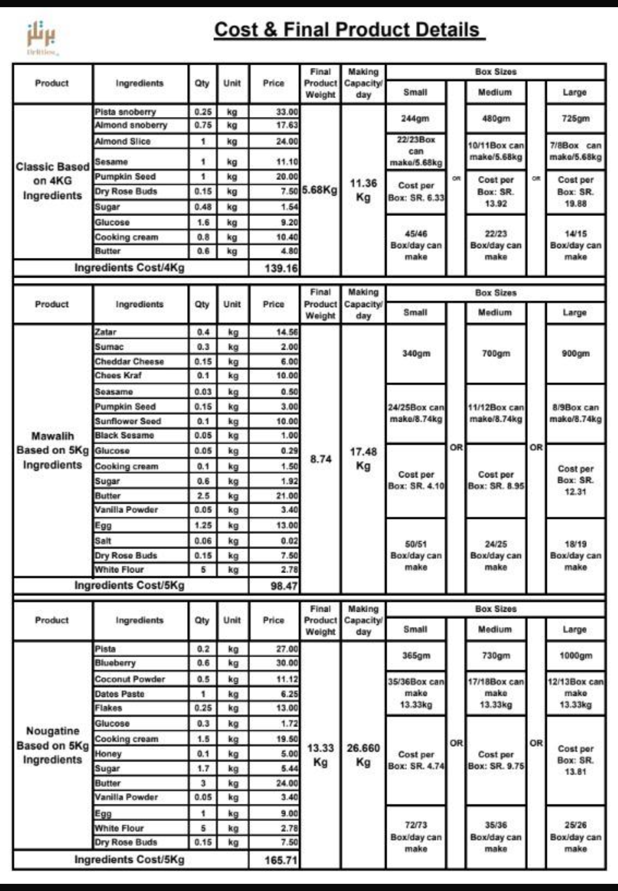

  

 

<h1 align="center">🍫 Brittles Production Optimization</h1>

  <b>Linear Programming · Excel Solver · Sensitivity Analysis · Business Analytics</b>

  <i>Turning real business data into smarter production and growth decisions.</i>

---

> **What if optimization could tell a small business not only what to produce — but where its next growth opportunity is?**

The project started with a simple question:

> **What is actually limiting Brittles' growth: ingredient budget, production capacity, product mix, or demand?**

Using real product information together with clearly identified planning assumptions, I built an optimization model in **Microsoft Excel Solver**, analyzed multiple production scenarios, and translated the mathematical results into practical business recommendations.

---

# 1. Business Context

Brittles currently produces two main product lines included in this model:

### Classic
A sweet product and currently the stronger-demand product.

### Salty
A savory product with lower ingredient cost relative to its selling price.

Both product lines are sold in:

- Small boxes
- Medium boxes

Information provided by the business also indicated that:

- Classic is currently the best-selling product.
- Classic receives interest from retail shops.
- Small boxes generally sell more frequently.
- Special occasions or weekends can occasionally generate larger orders.
- Production operates approximately **5 days per week**.
- Available production time was modeled as approximately **30 hours per week**.
- Classic preparation can require several hours depending on production quantity.

This created an interesting optimization question:

> **Should Brittles simply produce more of its most popular product, or could a different product mix generate better economic results?**

---

# 2. Original Product Data

The available production records included ingredient costs, batch output, production capacity, and historical package sizes.

  

## Classic

Original ingredient batch:

| Metric | Value |
|---|---:|
| Ingredient cost | 139.16 SAR |
| Ingredient quantity | 4 kg |
| Final product output | 5.68 kg |
| Reported daily production capacity | 11.36 kg |

The historical packaging data also included approximately:

| Historical Size | Weight | Estimated Cost |
|---|---:|---:|
| Small | 244 g | 6.33 SAR |
| Medium | 480 g | 13.92 SAR |
| Large | 725 g | 19.88 SAR |

---

## Salty

Original ingredient batch:

| Metric | Value |
|---|---:|
| Ingredient cost | 98.47 SAR |
| Ingredient quantity | 5 kg |
| Final product output | 8.74 kg |
| Reported daily production capacity | 17.48 kg |

Historical packaging included:

| Historical Size | Weight | Estimated Cost |
|---|---:|---:|
| Small | 340 g | 4.10 SAR |
| Medium | 700 g | 8.95 SAR |
| Large | 900 g | 12.31 SAR |

---

# 3. Current Menu

The optimization model focuses on the current Small and Medium products.

| Product | Current Weight | Selling Price |
|---|---:|---:|
| Classic Small | 220 g | 55 SAR |
| Classic Medium | 425 g | 120 SAR |
| Salty Small | 270 g | 65 SAR |
| Salty Medium | 625 g | 130 SAR |

---

# 4. Estimating Ingredient Cost

Because current package weights differ from the historical package sizes, ingredient cost was estimated proportionally from batch-level production data.

## Classic

Estimated ingredient cost per gram:

`139.16 / 5680 ≈ 0.0245 SAR/g`

Therefore:

### Classic Small

`220 × 0.0245 ≈ 5.39 SAR`

### Classic Medium

`425 × 0.0245 ≈ 10.41 SAR`

---

## Salty

Estimated ingredient cost per gram:

`98.47 / 8740 ≈ 0.01127 SAR/g`

Therefore:

### Salty Small

`270 × 0.01127 ≈ 3.04 SAR`

### Salty Medium

`625 × 0.01127 ≈ 7.04 SAR`

---

# 5. Estimated Contribution per Box

For this model:

**Contribution = Selling Price − Estimated Ingredient Cost**

| Product | Price | Ingredient Cost | Estimated Contribution |
|---|---:|---:|---:|
| Classic Small | 55 | 5.39 | **49.61 SAR** |
| Classic Medium | 120 | 10.41 | **109.59 SAR** |
| Salty Small | 65 | 3.04 | **61.96 SAR** |
| Salty Medium | 130 | 7.04 | **122.96 SAR** |

An important distinction:

> ⚠️ These values represent **estimated contribution after ingredient cost**, not net profit.

Packaging, labor, electricity, delivery, waste, and other operating expenses are not yet included.

---

# 6. Early Business Insight

Even before running Solver, the contribution calculations revealed something interesting.

For comparable sizes:

### Small

Salty Small contributes:

`61.96 − 49.61 = 12.35 SAR`

more per box than Classic Small.

### Medium

Salty Medium contributes:

`122.96 − 109.59 = 13.37 SAR`

more per box than Classic Medium.

Therefore, based only on the currently available ingredient-cost information:

> **Salty generates a higher estimated contribution per box than Classic.**

However, Classic currently has stronger observed customer demand.

This creates an important business trade-off:

**Classic appears stronger from a demand perspective, while Salty appears stronger from a contribution perspective.**

---

# 7. Optimization Objective

The purpose of the model is to determine the weekly production mix that maximizes estimated contribution while respecting operational and business constraints.

---

# 8. Decision Variables

Let:

`X1` = number of Classic Small boxes produced per week

`X2` = number of Classic Medium boxes produced per week

`X3` = number of Salty Small boxes produced per week

`X4` = number of Salty Medium boxes produced per week

---

# 9. Objective Function

The model maximizes estimated weekly contribution:

**Maximize**

`Z = 49.61X1 + 109.59X2 + 61.96X3 + 122.96X4`

---

#  10. Production-Time Constraint

For planning purposes, the following production-time coefficients were used:

| Product | Modeled Time per Box |
|---|---:|
| Classic Small | 30 min |
| Classic Medium | 48 min |
| Salty Small | 24 min |
| Salty Medium | 42 min |

With approximately:

`5 days × 6 hours = 30 hours/week`

the weekly production capacity becomes:

`30 × 60 = 1800 minutes`

Therefore:

`30X1 + 48X2 + 24X3 + 42X4 ≤ 1800`

> ⚠️ The per-box production times are planning assumptions and should be replaced by measured production times in a future version of the model.

---

# 💵 11. Ingredient Expenditure Constraint

Using the estimated ingredient cost per box:

`5.39X1 + 10.41X2 + 3.04X3 + 7.04X4 ≤ 800`

The business indicated an ingredient purchasing budget in the approximate range of **600–800 SAR for Classic ingredients**.

For the current optimization exercise, an **800 SAR planning limit** was applied across the modeled product mix.

> This is a modeling simplification and not a claim that the business currently allocates exactly 800 SAR across all four products.

---

# 12. Business Constraints

Several management constraints were incorporated into the model.

### Minimum Classic Production

Because Classic is the strongest-demand product:

`X1 + X2 ≥ 3`

### Small vs. Medium Product Mix

Because small boxes are reported to sell more frequently:

`X1 + X3 ≥ X2 + X4`

### Non-negativity

`X1, X2, X3, X4 ≥ 0`

---

# 13. Demand Scenarios

Historical weekly demand was not available in sufficient detail to create statistically estimated demand bounds.

Therefore, demand limits in this project are treated as **planning scenarios**, not verified historical demand.

Several scenarios were explored to understand how the business behaves under different demand levels.

---

## Scenario A — Low Demand

One early model used:

`X1 ≤ 8`

`X2 ≤ 4`

`X3 ≤ 2`

`X4 ≤ 3`

Solver selected all four products at their assumed demand limits.

### Result

| Metric | Result |
|---|---:|
| Classic Small | 8 |
| Classic Medium | 4 |
| Salty Small | 2 |
| Salty Medium | 3 |
| Production Time | 606 / 1800 min |
| Ingredient Expenditure | 111.96 / 800 SAR |
| Estimated Contribution | **1,328.04 SAR** |

### Interpretation

Neither production capacity nor ingredient budget was close to being exhausted.

The business could theoretically produce substantially more than the modeled demand.

This suggested that under low-demand conditions:

> **Demand, rather than production resources, limits growth.**

---

# 14. Higher-Demand Capacity Scenario

A larger hypothetical demand scenario was also tested:

`X1 ≤ 30`

`X2 ≤ 15`

`X3 ≤ 20`

`X4 ≤ 10`

The optimal solution was:

| Product | Quantity |
|---|---:|
| Classic Small | 6 |
| Classic Medium | 15 |
| Salty Small | 20 |
| Salty Medium | 10 |

### Result

| Metric | Result |
|---|---:|
| Production Time | **1800 / 1800 min** |
| Ingredient Expenditure | **319.69 / 800 SAR** |
| Estimated Contribution | **4,410.31 SAR** |

Here, production time became fully utilized.

### Interpretation

At sufficiently high demand:

> **Production time becomes the bottleneck before ingredient budget does.**

This scenario demonstrates how the business constraint can shift as demand increases.

At low demand:

**Demand → bottleneck**

At higher demand:

**Production capacity → bottleneck**

---

#  15. Intermediate Planning Scenario

A more moderate planning scenario was tested using:

`X1 ≤ 20`

`X2 ≤ 10`

`X3 ≤ 15`

`X4 ≤ 8`

Solver returned:

| Product | Quantity |
|---|---:|
| Classic Small | **20** |
| Classic Medium | **10** |
| Salty Small | **15** |
| Salty Medium | **8** |

### Financial Result

**Estimated weekly contribution:**

`4,001.18 SAR`

### Production Capacity

Production time used:

`1776 / 1800 minutes`

Utilization:

`1776 / 1800 × 100 ≈ 98.7%`

Only:

`24 minutes`

of modeled weekly production capacity remained.

### Ingredient Expenditure

Ingredient expenditure:

`313.82 / 800 SAR`

Remaining modeled budget:

`800 − 313.82 = 486.18 SAR`

---

# 💡 16. What Does This Scenario Tell Us?

This scenario produces an important result.

Brittles uses approximately:

**98.7% of modeled production time**

while using only approximately:

**39.2% of the modeled ingredient budget**

Therefore:

> **Buying additional ingredients alone would not solve the growth problem in this scenario.**

The business already has substantial unused purchasing capacity.

Meanwhile, production time is close to its limit.

This suggests a progression:

**Current/low demand → Demand is limiting**

⬇️

**Demand grows → Production capacity becomes increasingly important**

⬇️

**Higher demand → Production time can become the bottleneck**

---

#  17. Additional Solver Run

Another lower-demand scenario was tested:

`X1 ≤ 20`

`X2 ≤ 10`

`X3 ≤ 10`

`X4 ≤ 5`

Solver returned:

| Product | Quantity |
|---|---:|
| Classic Small | 20 |
| Classic Medium | 10 |
| Salty Small | 10 |
| Salty Medium | 5 |

### Results

| Metric | Result |
|---|---:|
| Production Time | 1530 / 1800 min |
| Time Slack | 270 min |
| Ingredient Expenditure | 277.50 / 800 SAR |
| Budget Slack | 522.50 SAR |
| Estimated Contribution | **3,322.50 SAR** |

Once again, the modeled demand limits were reached before the business exhausted its resources.

---

# 18. Sensitivity Analysis

A continuous Linear Programming version of the model was used to generate a Solver Sensitivity Report.

In the lower-demand scenario:

### Production Time

- Final usage: **1530 minutes**
- Available: **1800 minutes**
- Slack: **270 minutes**
- Shadow Price: **0**

### Ingredient Expenditure

- Final usage: **277.50 SAR**
- Available: **800 SAR**
- Slack: **522.50 SAR**
- Shadow Price: **0**

### Interpretation

A Shadow Price of zero indicates that increasing these resources would not improve the objective while the current solution structure remains valid.

This makes business sense.

If existing modeled demand is already fully satisfied, providing additional production minutes or additional ingredient budget does not automatically create new sales.

> **More capacity does not create value unless there is demand to use it.**

---

#  19. The Main Business Finding

The most important result from this project is not a Solver output.

It is the relationship between:

**Demand → Capacity → Profitability**

Under the lower-demand planning scenarios, Brittles has enough production and ingredient capacity to satisfy the assumed demand.

Therefore, increasing the ingredient budget alone is unlikely to be the first growth lever.

Instead, the analysis suggests that:

> **Demand generation may currently provide more value than resource expansion.**

If marketing successfully increases demand, however, the model indicates that production time could eventually become the next operational bottleneck.

---

#  20. Why Salty Is Particularly Interesting

Classic is currently the stronger-demand product.

However, based on the available ingredient-cost data:

| Size | Classic Contribution | Salty Contribution | Difference |
|---|---:|---:|---:|
| Small | 49.61 | **61.96** | **+12.35 SAR** |
| Medium | 109.59 | **122.96** | **+13.37 SAR** |

Therefore:

> **Salty currently produces a higher estimated contribution per box for both modeled sizes.**

This does **not** mean Brittles should replace Classic with Salty.

Classic has something extremely valuable:

**existing demand.**

Instead, the analysis reveals a potential opportunity:

> Maintain Classic as a core demand-driving product while experimenting with stronger marketing for the higher-contribution Salty line.

If Salty demand can be increased without significantly increasing production cost or preparation time, it could become an important source of growth.

---

#  21. Business Recommendations

Based on the current analysis, the following actions could be explored.

### 1. Focus on Demand Generation

The lower-demand scenarios indicate that the business has unused operational capacity.

Therefore, marketing and customer acquisition may currently have greater growth potential than simply increasing the ingredient budget.

---

### 2. Increase Visibility of Salty Products

Salty currently shows higher estimated contribution per box.

Brittles could test:

- More Salty-focused social media content
- Product bundles
- Sampling campaigns
- Weekend promotions
- Salty + Classic combinations
- Retail partnerships
- Limited promotional campaigns

The goal is not to replace Classic, but to determine whether stronger marketing can increase demand for a potentially attractive product line.

---

### 3. Keep Classic as a Core Product

Classic remains strategically important because it currently has stronger demand and retail interest.

Optimization should support customer demand — not ignore it.

Therefore, Classic can remain a central product while Salty is developed as an additional growth opportunity.

---

### 4. Measure Real Production Time

Production time could become the next bottleneck if demand increases.

The business should measure actual preparation time for each product and size rather than relying on planning assumptions.

This would make future optimization significantly more accurate.

---

### 5. Track Complete Product Cost

Future analysis should include:

- Ingredients
- Packaging
- Labor
- Electricity
- Delivery
- Waste
- Discounts
- Other operating expenses

This would allow the model to optimize **true profit** rather than ingredient-level contribution.

---

### 6. Build a Demand Dataset

For each order, Brittles could record:

`Date | Product | Size | Quantity | Selling Price | Ingredient Cost | Packaging Cost | Production Time | Sales Channel`

After several weeks, the business could determine:

- Actual weekly demand
- Best-selling products
- Most profitable products
- Demand by day
- Weekend effects
- Retail vs. direct-customer demand
- Product-level margins
- Capacity utilization

This would allow the optimization model to evolve from a planning model into a stronger **decision-support system**.

---

# 🔄 22. Business Growth Logic

The analysis suggests a possible growth path:

### Stage 1 — Current Demand

Demand is relatively low.

⬇️

Resources remain unused.

⬇️

**Priority: Marketing & Demand Generation**

---

### Stage 2 — Demand Growth

Orders increase.

⬇️

Production capacity becomes increasingly utilized.

⬇️

**Priority: Product Mix Optimization**

---

### Stage 3 — Capacity Constraint

Production time becomes binding.

⬇️

Not every potential order can necessarily be produced.

⬇️

**Priority: Capacity Expansion & Product Prioritization**

---

# ⚠️ 23. Assumptions & Limitations

This project intentionally separates real business information from modeling assumptions.

## Business-Sourced Information

The model uses available business information including:

- Product selling prices
- Product weights
- Ingredient batch costs
- Batch output
- Existing product lines
- Working schedule information
- Qualitative demand information
- Stronger demand for Classic
- Stronger preference for smaller boxes
- Retail interest in Classic

## Planning Assumptions

The following were introduced for modeling purposes and should not be interpreted as verified historical measurements:

- Per-box production-time coefficients
- Exact weekly demand upper bounds
- Applying the 800 SAR planning budget across all modeled products
- Some scenario-specific demand levels

The scenarios are therefore designed to answer:

> **“What would happen if demand looked like this?”**

rather than claim:

> **“This is Brittles' exact historical weekly demand.”**

---

# 🛠️ 24. Tools & Methods

### Tools

- Microsoft Excel
- Excel Solver

### Analytical Methods

- Linear Programming
- Operations Research
- Production Planning
- What-If Analysis
- Sensitivity Analysis
- Constraint Analysis
- Shadow Price Interpretation
- Business Analytics
- Decision Modeling

---

# 25. Future Development

This model can be expanded significantly.

Possible next steps include:

- Collecting real historical demand
- Measuring actual production times
- Adding packaging and labor costs
- Calculating true net profit
- Modeling retail-shop orders separately
- Adding weekend demand patterns
- Comparing direct sales vs. B2B orders
- Evaluating additional production capacity
- Automating data collection
- Rebuilding the optimization model in Python
- Developing a simple decision-support dashboard

With sufficient historical data, future versions could move from scenario-based optimization toward **data-driven demand forecasting and production optimization**.

---

# Final Takeaway

The original question was:

> **How should Brittles allocate its production resources?**

But the optimization revealed a more interesting business question:

> **What if the biggest opportunity is not producing more — but creating enough demand to use the capacity already available?**

The analyzed scenarios suggest that Brittles currently has room to grow before ingredient expenditure becomes a major constraint.

Classic provides the stronger existing demand.

Salty provides the higher estimated contribution per box based on currently available ingredient-cost information.

That leads to a practical strategy:

### Keep Classic strong.
### Test stronger demand generation for Salty.
### Measure real production data.
### Expand capacity only when demand justifies it.

---

**Built as a real-world Operations Research case study connecting mathematical optimization with business decision-making.**
